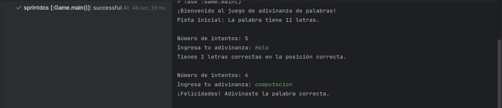
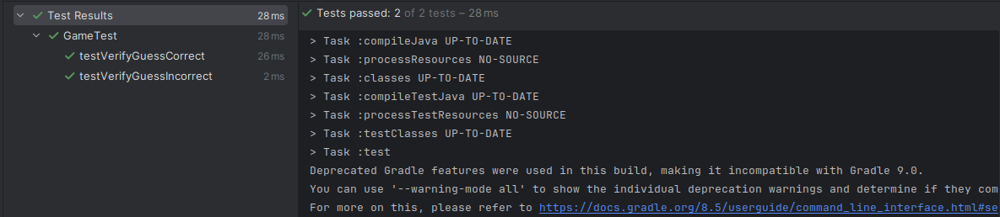

## Sprint 2

Tareas:
* Implementa la lógica para recibir adivinanzas del jugador.
* Genera y muestra retroalimentación.
* Realiza pruebas unitarias y de integración.
* Refactoriza el código basado en métricas CAMC y LCOM4.

### Aplicando TDD

Se muestra el proceso TDD para la clase `Game` que desde mi punto de vista es la más importante
para este Sprint.

* **Escribir una prueba fallida (Red)**

Código de test: clase `GameTest`
```
//este test verifica que el método verifyGuess() retorne false, ya que la palabra ingresada no es correcta
@Test
public void testVerifyGuessIncorrect(){
    Game game = new Game();
    String incorrectWord = "manzana";

    Boolean result = game.verifyGuess();

    assertFalse(result);
}
```

Código de producción: clase `Game`
```
public Boolean verifyGuess(){//este método verifica si la palabra ingresada por el usuario es correcta
    return true;
}
```

* **Hacer que la prueba pase(Green)**

Código de producción: clase `Game`
```
public Boolean verifyGuess(){//este método verifica si la palabra ingresada por el usuario es correcta
    return false;
}
```

* **Refactorizar si es necesario(Refactor)**

Código de producción: clase `Game`
```
public Boolean verifyGuess(String guess){//este método verifica si la palabra ingresada por el usuario es correcta
    return guess.equalsIgnoreCase(hiddenWord.getWord());//true si adivinó, false si no adivinó
}
```

### Notas adicionales:

La clase `Game` tiene un método `getHiddenWord()`, este método se usó para poder realizar el test
`testVerifyGuessCorrect()` sin embargo esta no es la mejor manera de realizarlo, esto se mejorará
en el siguiente Sprint usando Mockito.

### Hallando el CAMC

CAMC: CAMC = [sumatorio de tipos de parámetros únicos utilizados por todos los métodos] /[número total de métodos× número máximo de parámetros por método.]

```
    Clase WordSelector CAMC no aplica, los metodos no utilizan parametros
    Clase HintGenerator CAMC = 2/(2*2) = 0.5
```

### Resultados



La imagen muestra la ejecución del programa, en este sprint se implementó toda la lógica del juego, ya nos muestra si ganaste o no el juego.



La imagen muestra la ejecución de los test para la clase `Game`, se realizaron los siguientes test:
* test verifica que el método verifyGuess() retorne false, ya que la palabra ingresada no es correcta
* test verifica que el método verifyGuess() retorne true, ya que la palabra ingresada es correcta

Se implementaron más test en la clase `HintGeneratorTest`, estos están explicados en dicha clase.