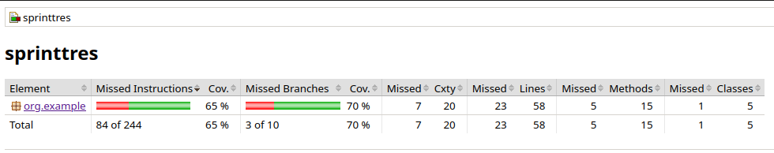
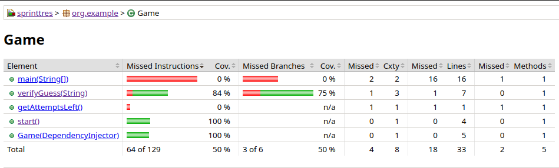
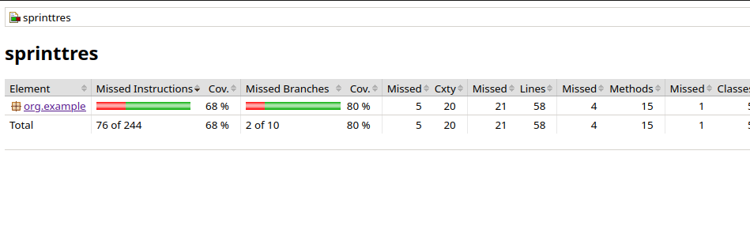

## Sprint 3

Tareas:
* Integrar y refinar todas las partes del juego
* Optimizar el código aplicando métricas de complejidad ciclomática.
* Implementar inyección de dependencias.
* Realizar pruebas finales y refactorización.

### Ejercicio 1: Implementa la inyección de dependencias para las clases WordSelector y HintGenerator.
Se creó las interfaces `IWordSelector` y `IHintGenerator`; se implementaron en las clases `WordSelector` y `HintGenerator`.

```
// Interfaz IWordSelector
public interface IWordSelector {
    Word selectWord();
}
```
```
// Interfaz IHintGenerator
public interface IHintGenerator {
    String generateHint(String hiddenWord, String guess);
    public String generateInitialHint(Word word);
}
```
Ahora modificamos la clase `Game` para usar estas interfaces a través de inyeccion de dependencias.

A continuación se muestra el constructor de la clase `Game` como prueba de la inyección de dependencias.
```
public Game(IWordSelector wordSelector, IHintGenerator hintGenerator) {
    this.wordSelector = wordSelector;
    this.hintGenerator = hintGenerator;
}
```

### Ejercicio 2: Implementa un contenedor de inyección de dependencias simple para gestionar las dependencias del juego

Clase: `DependencyInjector`

Creamos un mapa privado llamado "dependencies" que almacena instancias de dependencias, donde la clave es una clase y el valor es un objeto.

`private Map<Class<?>, Object> dependencies = new HashMap<>();`

Creamos el método que registra una dependencia en el mapa "dependencies", donde la clave es la clase classType y el valor es la instancia classImplementation.
```
public <T> void addDependency(Class<T> classType, T classImplementation) {
    dependencies.put(classType, classImplementation);
}
```

Este método busca una dependencia en el mapa "dependencies" y devuelve su instancia.
```
public <T> T getDependency(Class<T> classType) {
    return (T) dependencies.get(classType);
}
```

### Ejercicio 3: Aplica principios SOLID al código del juego

* Aplicando SRP al método `start()` de la clase `Game`

El método hasta el sprint 2 se encargaba de llamar al método `selectWord()` y tambien manejaba
la lógica del juego, este tenía un bucle while que iteraba hasta que el jugador adivine o no la palabra.

```
while (attemptsLeft>0){
    System.out.println();
    System.out.println("Número de intentos: "+attemptsLeft);
    System.out.print("Ingresa tu adivinanza: ");
    Scanner scanner = new Scanner(System.in);
    String guess = scanner.nextLine();

    if (verifyGuess(guess)) {//si adivina la palabra se muestra un mensaje
        System.out.println("¡Felicidades! Adivinaste la palabra correcta.");
        return;
    } else {//si no adivina la palabra se da una pista
        System.out.println(hintGenerator.generateHint(hiddenWord.getWord(), guess));
        attemptsLeft--;
    }
}
```
Ahora el método `start()` se ve de la siguiente manera:
```
public void start() {//metodo para comenzar el juego
    this.hiddenWord = wordSelector.selectWord();
    System.out.println("Pista inicial: " + hintGenerator.generateInitialHint(hiddenWord));
}
```
este está encargado de llamar al método `selectWord()` para seleccionar la palabra aleatoria.

Y la responsabilidad de verificar si adivinaste la palabra se trasladó al método `verifyGuess()`.
```
public String verifyGuess(String guess){//este método verifica si la palabra ingresada por el usuario es correcta
        if (guess.equalsIgnoreCase(hiddenWord.getWord())){//true si adivinó, false si no adivinó
            attemptsLeft=-1;
            return "¡Felicidades! Adivinaste la palabra correcta.";
        }else{
            attemptsLeft--;
            if (attemptsLeft == 0) {
                return "Lo siento, no adivinaste la palabra. La palabra era: " + hiddenWord.getWord();
            }
            return  hintGenerator.generateHint(hiddenWord.getWord(), guess);
        }
}
```
* DIP: Se cumple este principio ya que implementamos las interfaces `IWordSelector` y `IHintGenerator` en el ejercico 1.
* LSP: Se cumple este principio porque cada implementacion de las interfaces solo realiza lo que se espera, no hay efectos secundarios no deseados.
* OCP: Se cumple este principio porque las clases como `Game`, `WordSelector`, `HintGenerator` y las interfaces `IWordSelector`, `IHintGenerator` están diseñadas para ser
  extendidas sin modificar su comportamiento interno. Por ejemplo, si deseamos agregar nuevas formas de seleccionar palabras o generar pistas, podemos crear
  nuevas clases que implementen `IWordSelector` o `IHintGenerator` sin necesidad de cambiar las clases existentes.
* ISP: Se cumple este principio porque las interfaces `IWordSelector` e `IHintGenerator` están diseñadas para proporcionar solo los métodos necesarios para las responsabilidades específicas.

#### Aplicando Mockito
Vamos a usar mockito para verificar el comportamiento del método `verifyGuess()`, este es un ejemplo de la implementación,
en la clase `GameTest` tenemos otros test que también usan Mockito.

```
when(dependencyInjector.getDependency(IHintGenerator.class)).thenReturn(new HintGenerator());
when(dependencyInjector.getDependency(IWordSelector.class)).thenReturn(new WordSelector());
```
Aquí estamos usando mocks para inyectar dependencias en la clase Game.
El método when(...).thenReturn(...) se utiliza para definir el comportamiento de los mocks:
* IHintGenerator se reemplaza por una instancia real de HintGenerator.
* IWordSelector se reemplaza por una instancia real de WordSelector.

El test quedaría de la siguiente manera:
```
public void testVerifyGuessIncorrect(){
  when(dependencyInjector.getDependency(IHintGenerator.class)).thenReturn(new HintGenerator());
  when(dependencyInjector.getDependency(IWordSelector.class)).thenReturn(new WordSelector());

  String incorrectWord = "abcxyz";
  game = new Game(dependencyInjector);
  game.start();

  assertEquals("Tienes 0 letras correctas en la posicion correcta.", game.verifyGuess(incorrectWord));
}
```
Este test verifica que cuando ingreses una palabra incorrecta(en este caso abcxyz) debe retornar que ni una de las
letras de dicha palabra coincide con la palabra aleatoria selccionada.

### Ejercicio 4: Aplicar TDD y Jacoco para desarrollar una nueva funcionalidad y refactorizar el código existente

Reporte de JaCoCO 1: El siguiente reporte de JaCoCo muestra que tenemos una cobertura del 65%.



Ahora nos enfocaremos en la clase `Game`, como podemos observar las pruebas no cubren al 100% los métodos `verifyGuess()`, `getAttemptsLeft()`
y `main()`, sin embargo el método `main()` es poco común probarlo así que lo omitiremos.



#### Test del método verifyGuess() usando Mockito.

En este caso no solo vamos a usar mocks para inyectar dependencias, también usaremos mocks para controlar la palabra aleatoria que se escogerá.

`when(wordSelector.selectWord()).thenReturn(new Word("ciencias"));`

El test completo quedaría de la siguiente manera
```
public void testVerifyZeroAttempts(){
        //utilizamos mockito para la inyección de dependencias
        when(dependencyInjector.getDependency(IHintGenerator.class)).thenReturn(hintGenerator);
        when(dependencyInjector.getDependency(IWordSelector.class)).thenReturn(wordSelector);

        String correctWord = "platano";
        game = new Game(dependencyInjector);
        //mockeamos el comportamiento del método selectWord(), este retornará "ciencias" como palabra aleatoria
        when(wordSelector.selectWord()).thenReturn(new Word("ciencias"));

        game.start();
        String result="";

        for (int i=1;i<=5;i++){
            result = game.verifyGuess("platano");
        }

        assertEquals("Lo siento, no adivinaste la palabra. La palabra era: ciencias", result);
}
```

Una vez implementados los test para los métodos anteriores vemos que nuestra cobertura es del 68%.



Nota: Para ver el reporte de JaCoCo dirigirse hacia `sprinttres/build/reports/jacoco/test/html`