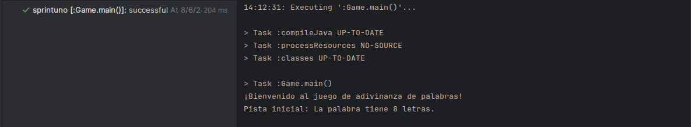
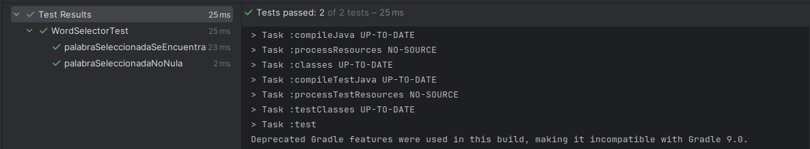
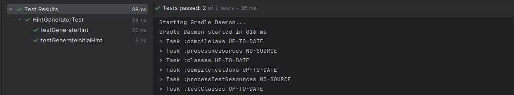

## Sprint 1

Tareas:
* Configurar el entorno de desarrollo.
* Implementar las pruebas básicas.
* Crear la estructura inicial de clases y métodos.
* Aplicar métricas de cohesión y LCOM.

### Configuración del entorno de desarrollo

Se configurará el entorno para este y posteriores sprints.

* Dependencias de JUnit y Mockito

```
dependencies {
    testImplementation platform('org.junit:junit-bom:5.10.0')
    testImplementation 'org.junit.jupiter:junit-jupiter'
    
    // Mockito Core
    testImplementation 'org.mockito:mockito-core:4.0.0'

    // Mockito JUnit 5 Integration
    testImplementation 'org.mockito:mockito-junit-jupiter:4.0.0'

}
```
* JaCoCo
```
plugins {
    id 'java'
    id 'jacoco' // Plugin de JaCoCo
}
```
```
jacoco {
    toolVersion = "0.8.12" // Versión de JaCoCo (compatible con java 21)
}

jacocoTestReport {
    dependsOn test // Ejecuta las pruebas antes de generar el informe

    reports {
        xml.required.set(true)
        html.required.set(true)
    }
}
```

### Aplicando TDD

* **Escribir una prueba fallida (Red)**

Código de test: clase `WordSelectorTest`
```
//este test verifica que la palabra que retorna la funcion, no sea nula
@Test
public void palabraSeleccionadaNoNula(){
  WordSelector wordSelector = new WordSelector();
  
  Word word = wordSelector.selectWord();//seleciona una palabra

  assertNotNull(word, "La palabra seleccionada no debería ser nula");
}
```

Código de producción: clase `WordSelector`
```
public Word selectWord() {//este método devolverá una palabra aleatoria de una lista dada
    return null;
}
```

* **Hacer que la prueba pase(Green)**

Código de producción: clase `WordSelector`
```
public Word selectWord() {//este método devolverá una palabra aleatoria de una lista dada
    return new Word("CC3S2);
}
```

* Refactorizar si es necesario(Refactor)

Código de producción: clase `WordSelector`
```
public class WordSelector {
    private List<Word> wordList;

    public WordSelector() {//constructor de la clase, añade 4 palabras
        wordList = new ArrayList<>();
        wordList.add(new Word("CC3S2"));
        wordList.add(new Word("Hola mundo"));
    }
    public Word selectWord() {//este método devolverá una palabra aleatoria de una lista dada
        Random random = new Random();
        int index = random.nextInt(wordList.size());
        return wordList.get(index);
    }
}
```
* Repetimos el proceso: **Escribir una prueba fallida (Red)**

Código de test: clase `WordSelectorTest`
```
//este test verifica que la palabra seleccionada por el método selectWord() debe estar dentro de la lista de palabras
@Test
public void palabraSeleccionadaSeEncuentraEnLaLista() {
    Word word = wordSelector.selectWord();//seleciona una palabra

    String[] validWords = {"ciencias", "computacion", "desarrollo", "software"};//lista de palabras

    assertTrue(asList(validWords).contains(word.getWord()), "La palabra seleccionada debería estar en la lista de palabras");
}
```
* **Hacer que la prueba pase(Green)**

Código de producción: clase `WordSelector`
```
public WordSelector() {//constructor de la clase, añade 4 palabras
    wordList = new ArrayList<>();
    wordList.add(new Word("ciencias"));
    wordList.add(new Word("computacion"));
    wordList.add(new Word("desarrollo"));
    wordList.add(new Word("software"));
}
```
* Refactorizar si es necesario(Refactor)

Código de producción: clase `WordSelector`
```
public Word selectWord() {//este método devolverá una palabra aleatoria de una lista dada
    Random random = new Random();
    return wordList.get(random.nextInt(wordList.size()));
}
```
Código de test: clase `WordSelectorTest`
```
private WordSelector wordSelector;

    @BeforeEach
    public void setUp() {
        wordSelector = new WordSelector();
}
```

* Ahora aplicamos TDD para la clase `HintGenerator`, este proceso no se detallará
para evitar redundar en la metodología pero se siguio el mismo enfoque.

### Métricas de cohesión y LCOM

* Acoplamiento eferente y aferente
```
Clase: WordSelector
    Ce = 1, WordSelector depende de la clase Word
    Ca = 1, la clase Game depende de la clase WordSelector
CLase: HintGenerator
    Ce = 1, HintGenerator depende de la clase Word
    Ca = 1, la clase Game depende de la clase HintGenerator
```
* LCOM
```
Clase: WordSelector
    LCOM = |P|-|Q| = 0 - 1 = -1, esto quiere decir que la clase es altamente cohesiva
CLase: HintGenerator
    LCOM = |P|-|Q| = 1 - 0 = 1, la clase no comparte atributos de instancia, sin embargo la clase tiene métodos utilitarios que operan independientemente
```

### Resultados



La imagen muestra la ejecución del programa, en este sprint se muestra un mensaje de bienvenida y una pista inicial.



La imagen muestra la ejecución de los test para la clase `WordSelector`, tenemos los siguientes test:
* test verifica que la palabra que retorna la funcion, no sea nula
* test verifica que la palabra seleccionada por el método selectWord() debe estar dentro de la lista de palabras


La imagen muestra la ejecución de los test para la clase `HintGenerator`, tenemos los siguientes test:
* test verifica que a palabra inicial tenga n letras, en este caso manzana tiene 7 letras
* test inicial del tdd, siempre pasará ya que el metodo generateHint() de la clase HintGenerator siempre nos devolvera
la cadena "Esta es una pista."
